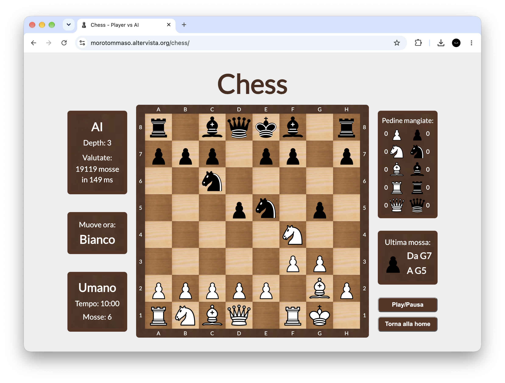
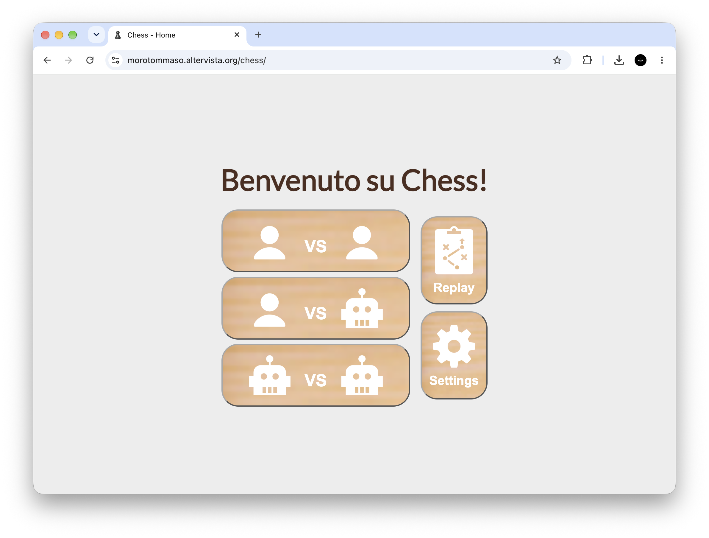
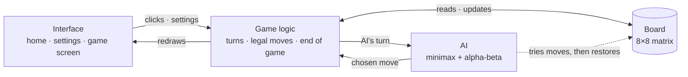

# Chess

A chess game for the browser, written from scratch in plain JavaScript, with a minimax AI to play against.

[](LICENSE)




**Live demo:** https://tommasomoro8.github.io/chess/

<!-- portfolio:summary
## The problem
I've always loved computers, and high school turned that into programming. During the second Covid lockdown in Italy I used my free time to rebuild chess and then get the computer to play against me.

## The solution
A web page with three modes: player vs player, player vs AI with four difficulty levels, and AI vs AI. Click a piece to see where it can move. Side panels show captured pieces, the last move and how many positions the AI evaluated.

## Technical challenges
- Legal moves: I try each move on a copy of the board and discard it if it leaves the king in check.
- Checkmate or stalemate: with no legal moves left, the game is lost if the king is attacked and drawn if not.
- The AI: minimax with alpha-beta pruning, following a freeCodeCamp guide, adapted to my own board representation.

## What I learned
- Modelling game state with 8×8 matrices.
- Driving a page through the DOM without a framework.
- How quickly global variables and repeated code become hard to change.

## Stack
HTML, CSS, JavaScript (no libraries), Google Fonts
-->

<!-- portfolio:start -->
## The problem

I've always loved computers, and my high-school lessons gave me a way to turn that into programming. I also enjoy chess, so when the second Covid lockdown in Italy left me with plenty of free time, I spent it on this: first rebuilding the game on screen, then getting the computer to play against me. It was one of my first structured projects and the one that got me hooked on programming. The code shows that: it is unfinished and could be better everywhere. I'm keeping it as it is, as a snapshot of how I wrote code back then.

## The solution

A single web page with three modes:

- **Player vs Player** on the same screen, with a draw request button for each side.
- **Player vs AI**: you play White, the AI plays Black. There are four difficulty levels (search depth 2 to 5).
- **AI vs AI**: two AIs play each other, with a separate depth for each side.

Click a piece and the squares it can move to light up. Click one of them to move. During the game, side panels show the move count, captured pieces, the last move and, for the AI, how many positions it evaluated and how many milliseconds that took. In the settings you can turn sound and move hints on or off and choose one of three piece styles.



## Technical challenges

- **Legal moves and check.** For each piece I first mark the squares it can reach. Then I try each move on a copy of the board and check whether any enemy piece now attacks my king. If one does, the move is discarded. Castling uses flags that record whether the king and each rook have moved. En passant uses a list of pawns that have just moved two squares.
- **Checkmate or stalemate.** After every move I work out every legal move for the side to play and every square the opponent attacks. If the side to play has no legal moves, the game ends: checkmate if its king is attacked, a draw if not. A board with only the two kings left is also a draw.
- **The AI.** I followed a [freeCodeCamp guide](https://www.freecodecamp.org/news/simple-chess-ai-step-by-step-1d55a9266977/): minimax with alpha-beta pruning. To score a position it adds up material (pawn 10, knight and bishop 30, rook 50, queen 90, king 900) plus a bonus for each piece's square. The hard part was fitting it to my own board. The board is a matrix of strings, not a chess library, so I save a copy of it before exploring each move and restore it afterwards.

## What I learned

- Representing game state with 2D arrays. The board, the reachable squares and the attacked squares are all 8×8 matrices.
- Driving a page from JavaScript through the DOM: redrawing 64 squares after every move and switching screens without reloading the page.
- Taking a recursive algorithm from a guide and fitting it to data structures I had designed myself.
- How quickly a single file of global variables and repeated functions gets hard to change. That's the first thing I would do differently.

## Stack

- HTML5
- CSS3 (separate landscape and portrait layouts with media queries)
- JavaScript, with no libraries or frameworks
- Google Fonts (Lato)
<!-- portfolio:end -->

## Architecture



- **One page, one script.** The home, settings and game screens are `div`s that are shown and hidden. There is no build step, so the game runs on any static host.
- **The board is a matrix of names.** Each square holds a string like `"Wpedone"` or `"vuoto"`. The first letter gives the colour, and the name is also the image file name (`src/img3pack/Wpedone.png`). That makes redrawing the board and switching piece styles a one-line change.
- **The AI runs in the same thread as the page.** That keeps the code simple, but the page doesn't respond while the AI is searching. At higher depths you notice it.

## Repository structure

```
chess/
├── src/                          ← the game
│   ├── index.html                ← home, settings and game screens, and the 64 squares
│   ├── app.js                    ← all the logic: navigation, rules, end of game, AI, rendering
│   ├── style.css                 ← layout and wood theme, landscape and portrait rules
│   ├── img1pack/ … img3pack/     ← the three piece styles you can pick in Settings
│   ├── imgbase/                  ← board textures, logos and icons
│   └── audio/                    ← sound effects: start, move, capture, castling, game end
├── docs/screenshots/             ← images used in this README
├── README.md
├── LICENSE
└── portfolio.yml                 ← metadata for my portfolio
```

## Known limitations and future work

- The timer can be set in Settings but doesn't count down.
- Replay and Play/Pause are placeholders.
- Pawns always promote to a queen.
- No draw by threefold repetition or by the 50-move rule.
- The AI never castles.
- The AI can't tell checkmate from stalemate. In the search, a side with no legal moves gets the same score either way, so the AI can stalemate an opponent it was beating.
- The AI only sees checkmate before the last level of its search. At depth 1 it misses even mate in one, and it doesn't prefer a quicker mate to a slower one.
- The interface is in Italian only.

If I picked it up again, I would rewrite it with classes and a model-view-controller split:

- **Model**: a `Game` class that holds the whole position (board, side to move, castling rights, en passant square) and knows the rules: legal moves, check, checkmate, stalemate. It never touches the DOM and can copy itself.
- **View**: draws the board and the side panels from the model's state and plays the sounds. Today rule code and screen updates are mixed together (pawn promotion redraws all 64 squares).
- **Controller**: handles clicks and settings, asks the model to play moves and the AI for its move, then tells the view to update.
- **AI**: a separate module that only works on copies of `Game`. That would let it castle and capture en passant, and run in a Web Worker so the page keeps responding.

With the rules isolated from the page I could finally add tests for move generation. In the AI I would score checkmate and stalemate differently and rank closer mates higher.

## Credits and license

- Code and chess logic: Tommaso Moro.
- The AI is based on the freeCodeCamp guide [*A step-by-step guide to building a simple chess AI*](https://www.freecodecamp.org/news/simple-chess-ai-step-by-step-1d55a9266977/).

The code is released under the [MIT License](LICENSE).

---

Created by Tommaso Moro in May 2021.
